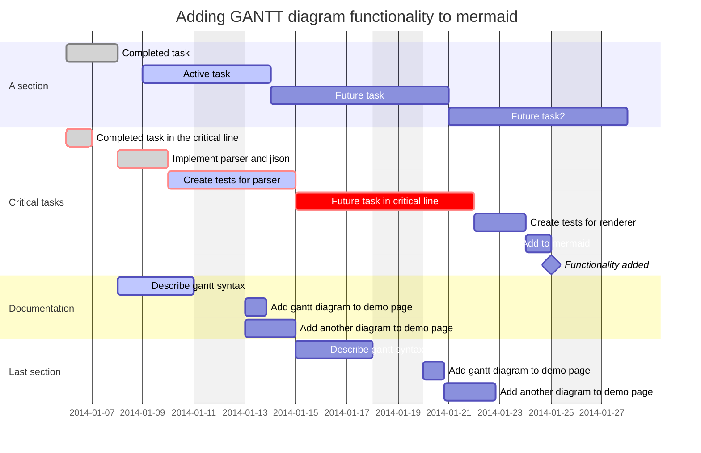

# hello-world
My first repository

I recently joined Github and I am eager to learn

Testing rebase function 1 & 2

Other merge test

Test desktop

### Test

| Title | Title 1 |      |      |
| ----- | ------- | ---- | ---- |
| Line  | Line 1  |      |      |
|       |         |      |      |
|       |         |      |      |

<ul class="member-listing table-list table-list-bordered adminable">
    
  <li class="table-list-item member-list-item js-bulk-actions-item " data-bulk-actions-id="colossus9">
      

        <input type="checkbox" name="members[]" value="colossus9" aria-label="colossus9" id="member-colossus9" class="js-bulk-actions-toggle" data-check-all-item="">
      

    

      
        
      
    

    

      <a class="f4 d-inline-block mr-1" data-hovercard-type="user" data-hovercard-url="/users/colossus9/hovercard" data-octo-click="hovercard-link-click" data-octo-dimensions="link_type:self" href="/colossus9">
        James Garcia
</a>        colossus9
        
          Team Poster
    

  </li>

    
  <li class="table-list-item member-list-item js-bulk-actions-item " data-bulk-actions-id="ppremk">
      

        <input type="checkbox" name="members[]" value="ppremk" aria-label="ppremk" id="member-ppremk" class="js-bulk-actions-toggle" data-check-all-item="">
      

    

      
        
      
    

    

      <a class="f4 d-inline-block mr-1" data-hovercard-type="user" data-hovercard-url="/users/ppremk/hovercard" data-octo-click="hovercard-link-click" data-octo-dimensions="link_type:self" href="/ppremk">
        Prem Kumar Ponuthorai
</a>        ppremk
        
          Team Poster
    

  </li>

    
  <li class="table-list-item member-list-item js-bulk-actions-item " data-bulk-actions-id="JaymePerlman">
      

        <input type="checkbox" name="members[]" value="JaymePerlman" aria-label="JaymePerlman" id="member-JaymePerlman" class="js-bulk-actions-toggle" data-check-all-item="">
      

    

      
        
      
    

    

      <a class="f4 d-inline-block mr-1" data-hovercard-type="user" data-hovercard-url="/users/JaymePerlman/hovercard" data-octo-click="hovercard-link-click" data-octo-dimensions="link_type:self" href="/JaymePerlman">
        JaymeP
</a>        JaymePerlman
        
          Team Poster
    

  </li>

    
  <li class="table-list-item member-list-item js-bulk-actions-item " data-bulk-actions-id="iburtally">
      

        <input type="checkbox" name="members[]" value="iburtally" aria-label="iburtally" id="member-iburtally" class="js-bulk-actions-toggle" data-check-all-item="">
      

    

      
        
      
    

    

      <a class="f4 d-inline-block mr-1" data-hovercard-type="user" data-hovercard-url="/users/iburtally/hovercard" data-octo-click="hovercard-link-click" data-octo-dimensions="link_type:self" href="/iburtally">
        Irshad Burtally
</a>        iburtally
        
          Team Poster
    

  </li>

    
  <li class="table-list-item member-list-item js-bulk-actions-item " data-bulk-actions-id="pinkstar70">
      

        <input type="checkbox" name="members[]" value="pinkstar70" aria-label="pinkstar70" id="member-pinkstar70" class="js-bulk-actions-toggle" data-check-all-item="">
      

    

      
        
      
    

    

      <a class="f4 d-inline-block mr-1" data-hovercard-type="user" data-hovercard-url="/users/pinkstar70/hovercard" data-octo-click="hovercard-link-click" data-octo-dimensions="link_type:self" href="/pinkstar70">
        Joni Mallari
</a>        pinkstar70
        
          Team Poster
    

  </li>

    
  <li class="table-list-item member-list-item js-bulk-actions-item " data-bulk-actions-id="jenna-wolf">
      

        <input type="checkbox" name="members[]" value="jenna-wolf" aria-label="jenna-wolf" id="member-jenna-wolf" class="js-bulk-actions-toggle" data-check-all-item="">
      

    

      
        
      
    

    

      <a class="f4 d-inline-block mr-1" data-hovercard-type="user" data-hovercard-url="/users/jenna-wolf/hovercard" data-octo-click="hovercard-link-click" data-octo-dimensions="link_type:self" href="/jenna-wolf">
        Jenna
</a>        jenna-wolf
        
          Team Poster
    

  </li>

    
  <li class="table-list-item member-list-item js-bulk-actions-item " data-bulk-actions-id="mary-curd">
      

        <input type="checkbox" name="members[]" value="mary-curd" aria-label="mary-curd" id="member-mary-curd" class="js-bulk-actions-toggle" data-check-all-item="">
      

    

      
        
      
    

    

      <a class="f4 d-inline-block mr-1" data-hovercard-type="user" data-hovercard-url="/users/mary-curd/hovercard" data-octo-click="hovercard-link-click" data-octo-dimensions="link_type:self" href="/mary-curd">
        Mary Curd
</a>        mary-curd
        
          Team Poster
    

  </li>

    
  <li class="table-list-item member-list-item js-bulk-actions-item " data-bulk-actions-id="michael-bruce">
      

        <input type="checkbox" name="members[]" value="michael-bruce" aria-label="michael-bruce" id="member-michael-bruce" class="js-bulk-actions-toggle" data-check-all-item="">
      

    

      
        
      
    

    

      <a class="f4 d-inline-block mr-1" data-hovercard-type="user" data-hovercard-url="/users/michael-bruce/hovercard" data-octo-click="hovercard-link-click" data-octo-dimensions="link_type:self" href="/michael-bruce">
        Michael Bruce
</a>        michael-bruce
        
          Team Poster
    

  </li>

    
  <li class="table-list-item member-list-item js-bulk-actions-item " data-bulk-actions-id="jackwillrawl">
      

        <input type="checkbox" name="members[]" value="jackwillrawl" aria-label="jackwillrawl" id="member-jackwillrawl" class="js-bulk-actions-toggle" data-check-all-item="">
      

    

      
        
      
    

    

      <a class="f4 d-inline-block mr-1" data-hovercard-type="user" data-hovercard-url="/users/jackwillrawl/hovercard" data-octo-click="hovercard-link-click" data-octo-dimensions="link_type:self" href="/jackwillrawl">
        Jack Rawlings
</a>        jackwillrawl
        
          Team Poster
    

  </li>

    
  <li class="table-list-item member-list-item js-bulk-actions-item " data-bulk-actions-id="ninfriendos">
      

        <input type="checkbox" name="members[]" value="ninfriendos" aria-label="ninfriendos" id="member-ninfriendos" class="js-bulk-actions-toggle" data-check-all-item="">
      

    

      
        
      
    

    

      <a class="f4 d-inline-block mr-1" data-hovercard-type="user" data-hovercard-url="/users/ninfriendos/hovercard" data-octo-click="hovercard-link-click" data-octo-dimensions="link_type:self" href="/ninfriendos">
        Ariel  McCollough
</a>        ninfriendos
        
          Team Poster
    

  </li>

    
  <li class="table-list-item member-list-item js-bulk-actions-item " data-bulk-actions-id="nscobb">
      

        <input type="checkbox" name="members[]" value="nscobb" aria-label="nscobb" id="member-nscobb" class="js-bulk-actions-toggle" data-check-all-item="">
      

    

      
        
      
    

    

      <a class="f4 d-inline-block mr-1" data-hovercard-type="user" data-hovercard-url="/users/nscobb/hovercard" data-octo-click="hovercard-link-click" data-octo-dimensions="link_type:self" href="/nscobb">
        Nathan Cobb
</a>        nscobb
        
          Team Poster
    

  </li>

    
  <li class="table-list-item member-list-item js-bulk-actions-item " data-bulk-actions-id="jc-fenelon">
      

        <input type="checkbox" name="members[]" value="jc-fenelon" aria-label="jc-fenelon" id="member-jc-fenelon" class="js-bulk-actions-toggle" data-check-all-item="">
      

    

      
        
      
    

    

      <a class="f4 d-inline-block mr-1" data-hovercard-type="user" data-hovercard-url="/users/jc-fenelon/hovercard" data-octo-click="hovercard-link-click" data-octo-dimensions="link_type:self" href="/jc-fenelon">
        Jean-Cedric Fenelon
</a>        jc-fenelon
        
          Maintainer
        
          Team Poster
    

  </li>

</ul>
