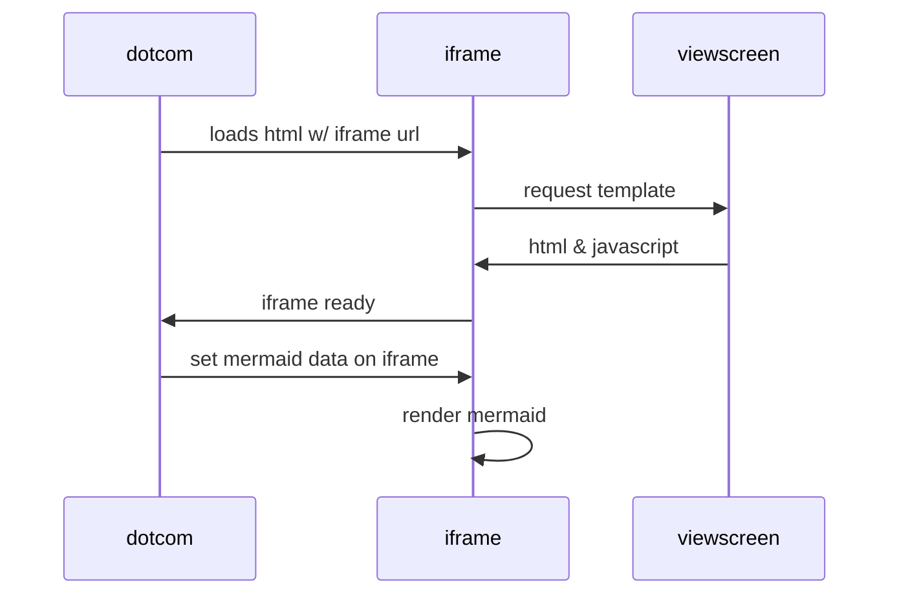

# hello-world
My first repository

I recently joined Github and I am eager to learn

Testing rebase function 1 & 2

Other merge test

Test desktop

### Test

| Title | Title 1 |      |      |
| ----- | ------- | ---- | ---- |
| Line  | Line 1  |      |      |
|       |         |      |      |
|       |         |      |      |

